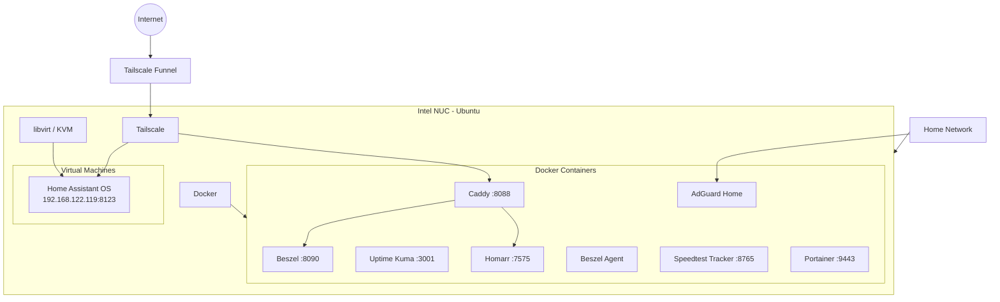

# Smart Home Server

This repository documents the configuration of my home server running on an
Intel NUC with Ubuntu.

The server provides:

- Home Assistant for home automation
- AdGuard Home for network-wide DNS filtering
- Homarr as the main dashboard
- Uptime Kuma for availability monitoring
- Beszel for server/container monitoring
- Speedtest Tracker for internet performance history
- Portainer for Docker management
- Caddy as a reverse proxy
- Tailscale for remote access and public HTTPS endpoints

---

# Architecture

## High-level architecture



---

# Networking

There are effectively three networks involved.

```text
                         INTERNET
                             │
                             │ HTTPS
                             ▼
                  ┌─────────────────────┐
                  │  Tailscale Funnel   │
                  └──────────┬──────────┘
                             │
                    Ubuntu / Tailscale
                             │
             ┌───────────────┴───────────────┐
             │                               │
          HTTPS :443                     HTTPS :8443
             │                               │
             ▼                               ▼
     ┌───────────────┐              ┌─────────────────┐
     │ Caddy :8088   │              │ Home Assistant  │
     └───────┬───────┘              │ 192.168.122.119 │
             │                      │      :8123       │
       ┌─────┴──────┐               └─────────────────┘
       │            │
       ▼            ▼
    Homarr        Beszel
     :7575         :8090
```

## Home LAN

The Ubuntu server currently has:

```text
10.0.0.13
```

Examples:

```text
Homarr:
http://10.0.0.13:7575

Uptime Kuma:
http://10.0.0.13:3001

Beszel:
http://10.0.0.13:8090

Speedtest Tracker:
http://10.0.0.13:8765

Portainer:
https://10.0.0.13:9443
```

AdGuard also binds DNS port 53 to this address.

Because other devices depend on `10.0.0.13` for DNS, this IP should remain
stable.

## libvirt network

Home Assistant does not run directly on the LAN.

It runs as a HAOS virtual machine on libvirt's private network:

```text
Ubuntu/libvirt gateway
192.168.122.1
       │
       │
       └──── Home Assistant
             192.168.122.119:8123
```

libvirt provides NAT between the Ubuntu host and the VM.

A DHCP reservation is configured so Home Assistant should always receive:

```text
192.168.122.119
```

Verify it with:

```bash
sudo virsh net-dumpxml default
```

Look for something similar to:

```xml
<host
    mac='52:54:00:xx:xx:xx'
    name='homeassistant'
    ip='192.168.122.119'/>
```

---

# Why each component exists

## Home Assistant OS

Home Assistant runs as a dedicated VM rather than a Docker container.

This provides the full HAOS environment, including:

- Home Assistant Supervisor
- Add-ons
- HAOS updates
- Backups
- Easier USB/device integration

The VM is isolated from the Docker services running on Ubuntu.

---

## Homarr

Homarr is the human-friendly front page for the server.

Instead of remembering:

```text
10.0.0.13:3001
10.0.0.13:8090
10.0.0.13:8765
10.0.0.13:9443
```

open Homarr and navigate from there.

---

## Uptime Kuma

Kuma answers:

> "Can I actually reach this service?"

Example monitors:

```text
Home Assistant
http://192.168.122.119:8123

Beszel
http://10.0.0.13:8090

Speedtest Tracker
http://10.0.0.13:8765
```

This is different from Beszel.

Kuma monitors **availability**.

Beszel monitors **resource usage and performance**.

---

## Beszel

Beszel monitors the Ubuntu host and Docker containers.

Examples:

- CPU usage
- RAM
- disk usage
- network traffic
- individual container resource usage
- historical utilization

Architecture:

```text
Beszel Hub
    │
    │ metrics
    ▼
Beszel Agent
    │
    ▼
Docker socket
    │
    ├── Homarr
    ├── Kuma
    ├── AdGuard
    ├── Caddy
    └── ...
```

---

## AdGuard Home

AdGuard is the DNS server for the home network.

For example, when a phone requests:

```text
youtube.com
```

the flow is approximately:

```text
Phone
  │
  │ DNS request
  ▼
AdGuard :53
  │
  ├── blocked domain → return blocked response
  │
  └── allowed domain → resolve normally
```

This provides network-wide:

- DNS filtering
- tracker blocking
- parental filtering
- DNS statistics
- custom DNS rules

---

## Caddy

Caddy is the reverse proxy.

Instead of exposing every Docker application independently, incoming HTTP
traffic can enter through Caddy and then be routed internally.

Current example:

```text
Internet
   │
Tailscale Funnel
   │
Caddy
   │
   ├── /        → Homarr :7575
   └── /beszel  → Beszel :8090
```

The configuration lives in:

```text
caddy/conf/Caddyfile
```

After changing it:

```bash
docker exec caddy \
    caddy reload --config /etc/caddy/Caddyfile
```

---

# Tailscale

Tailscale runs directly on Ubuntu using systemd.

It is intentionally not a Docker container because it provides networking
for the entire host.

Check it with:

```bash
systemctl status tailscaled
```

It automatically starts after reboot.

## Private Tailscale access

When a client is connected to the same tailnet, it can access the Ubuntu
machine through its stable Tailscale address/MagicDNS name.

This traffic remains private to the tailnet.

## Tailscale Funnel

Funnel is different.

Funnel makes selected services reachable from the public internet without
requiring the client to have Tailscale connected.

Current routing:

```text
https://home-server-ubuntu.tailf473.ts.net
                  │
                  ▼
                :443
                  │
                Caddy
                  │
                Homarr


https://home-server-ubuntu.tailf473.ts.net:8443
                  │
                  ▼
          Home Assistant :8123
```

Configure Homarr/Caddy:

```bash
sudo tailscale funnel --bg \
    --https=443 \
    http://127.0.0.1:8088
```

Configure Home Assistant:

```bash
sudo tailscale funnel --bg \
    --https=8443 \
    http://192.168.122.119:8123
```

Check:

```bash
tailscale funnel status
```

> **Security:** Funnel endpoints are internet-accessible. Do not expose
> administration services such as Portainer or AdGuard without considering
> authentication and the security implications.

---

# Secrets

Secrets must never be committed to Git.

For example, Beszel's Compose file contains:

```yaml
environment:
  KEY: "${BESZEL_KEY}"
  TOKEN: "${BESZEL_TOKEN}"
```

Create the real file locally:

```bash
cp .env.example .env
nano .env
```

Example:

```dotenv
BESZEL_KEY=...
BESZEL_TOKEN=...
```

`.env` is ignored by Git while `.env.example` is committed.

The same pattern is used for Speedtest Tracker and Homarr.

---

# Starting everything after a fresh installation

Docker services can be started individually:

```bash
cd ~/smarthome/beszel
docker compose up -d

cd ~/smarthome/caddy
docker compose up -d

cd ~/smarthome/speedtest-tracker
docker compose up -d

cd ~/smarthome/homarr
docker compose up -d

cd ~/smarthome/uptime-kuma
docker compose up -d

cd ~/smarthome/adguard
docker compose up -d

cd ~/smarthome/portainer
docker compose up -d
```

Then verify:

```bash
docker ps
```

Expected services include:

```text
homarr
uptime-kuma
adguard
speedtest-tracker
beszel
beszel-agent
portainer
caddy
```

Check HA:

```bash
sudo virsh list
```

Check Tailscale:

```bash
tailscale status
tailscale funnel status
```

---

# Troubleshooting

## Container isn't working

```bash
docker ps -a
docker logs <container>
```

Example:

```bash
docker logs speedtest-tracker --tail 100
```

## Caddy routing isn't working

Test Caddy locally:

```bash
curl -I http://127.0.0.1:8088
```

Then:

```bash
docker logs caddy
```

## Home Assistant isn't reachable

Test the VM directly:

```bash
curl -s -o /dev/null -w "%{http_code}\n" \
    http://192.168.122.119:8123
```

Expected:

```text
200
```

Check the VM:

```bash
sudo virsh list --all
```

## Funnel isn't working

```bash
tailscale funnel status
tailscale status
```

Always test the backend independently before debugging Funnel.

For example:

```text
Browser → Funnel → HA
```

Test:

```text
HA first
then Funnel
then browser
```

This makes it much easier to identify which layer is failing.

---

# Backup strategy

Git backs up **configuration**, not application state.

The following must be backed up separately:

| Service | Important data |
|---|---|
| Home Assistant | HA backups |
| Homarr | database/configuration |
| Uptime Kuma | monitoring database |
| AdGuard | configuration |
| Beszel | historical metrics |
| Speedtest Tracker | speed history/database |
| Portainer | Portainer data volume |

A complete disaster recovery therefore requires:

```text
Git repository
      +
HA backup
      +
Docker persistent-data backup
      =
Recoverable home server
```
